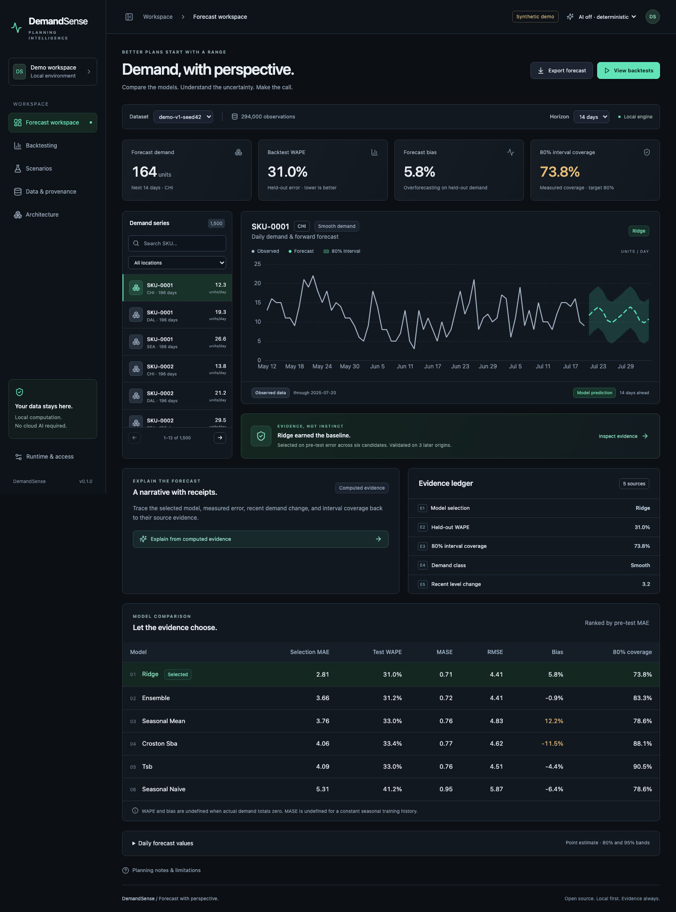
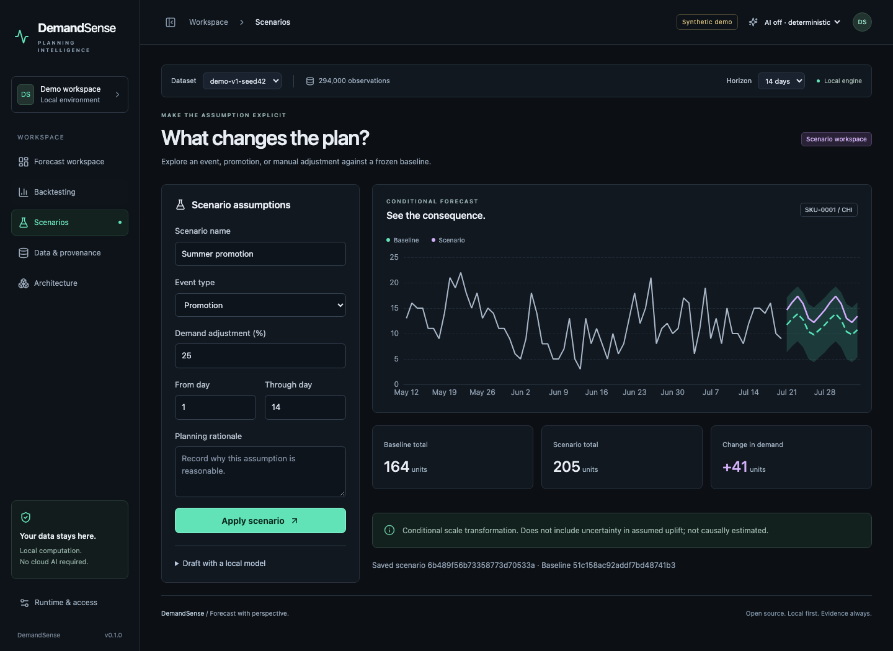
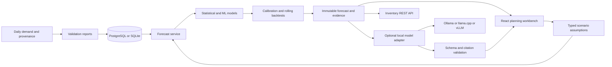

<div align="center">

# DemandSense

### Your forecast is a number. Your risk isn't.

**Probabilistic demand forecasting with uncertainty, backtesting, and explainable scenarios.**

Compare six models. Inspect the misses. Challenge the assumptions.<br/>
Run the entire workflow on your own machine—with the local AI model you choose, or no AI at all.

[Quick start](#run-it-locally) · [Screenshots](docs/screenshots/README.md) · [Measured results](#show-me-the-numbers) · [Architecture](docs/architecture.md) · [Contribute](CONTRIBUTING.md)

**MIT source · No paid API · No cloud AI required · 500-SKU demo**

</div>



## The number is the easy part

A demand plan of “1,000 units” hides the question a supply planner actually needs answered: *how wrong could this be, and what happens if the promotion lands differently?*

Stockouts, excess inventory, intermittent demand, and promotion shocks do not disappear when a chart looks confident. DemandSense puts the forecast next to its uncertainty, its backtest record, and the assumptions that would change the plan.

This is a working forecasting system: validated data → competing models → held-out evaluation → calibrated bands → versioned scenarios → an inventory-facing API. A local LLM can explain the evidence. The mathematics runs independently.

## Try to break the forecast

The default demo opens with **500 SKUs, three locations, 196 days, and 294,000 observations**. No upload, account, or model download is needed.

1. **Choose a SKU/location.** Start with SKU-0001 / CHI, then inspect an intermittent series such as SKU-0003.
2. **Inspect the range.** See observed demand, expected future units, and empirical 80% bands. Expand the daily table for both 80% and 95% bounds.
3. **Challenge the winner.** Compare six candidates on WAPE, MASE, RMSE, bias, and realized coverage. Inspect three held-out forecast origins.
4. **Change an assumption.** Apply a 25% promotion uplift to selected forecast days. The scenario gets its own ID and preserves the baseline.
5. **Ask for the receipts.** Generate an evidence-based explanation, optionally using an already-installed local model. Follow every claim to its evidence ID.
6. **Export the plan.** Download daily forecasts or consume the typed inventory API.



## What is implemented

| Capability | What you can inspect |
|---|---|
| Regular and intermittent demand | Seasonal naïve, weekday mean, Croston-SBA, TSB, ridge regression, equal-weight ensemble |
| Uncertainty | Empirical 80%/95% marginal bands; measured coverage; visible calibration limitations |
| Honest model comparison | Three pre-test selection/calibration origins, then three untouched rolling test origins |
| Error diagnostics | WAPE, seasonal MASE, RMSE, signed bias, coverage, per-origin trends, intermittency classes |
| Planner scenarios | Promotion, event, and manual adjustments with typed assumptions, lineage, and deterministic deltas |
| Optional local AI | Ollama discovery; local llama.cpp/vLLM-compatible adapter; model picker; schema/citation validation; safe fallback |
| Data quality | Immutable versions, stable IDs, source hashes, atomic imports, persisted row-level validation reports |
| Integration | Versioned REST, Pydantic contracts, OpenAPI, pagination, replayable writes, CSV export |
| Operations | PostgreSQL/SQLite, trace IDs, structured logs, model telemetry, health/readiness |

## Run it locally

### Docker Compose

Requires a running container engine with Docker Compose v2. An open-source engine works; a paid Docker subscription is not a product requirement.

```sh
git clone <your-published-repository-url> demandsense
cd demandsense
cp .env.example .env
docker compose up --build
```

Open **[localhost:5187](http://localhost:5187)**. API docs: **[localhost:8027/docs](http://localhost:8027/docs)**.

On first startup, the API generates and stores the full demo. The web service waits for API readiness. Data persists in a named PostgreSQL volume. Subsequent starts reuse it. `docker compose down` stops services without deleting that volume.

> **Verification status:** Native macOS execution and browser E2E are verified. Docker is not installed on the build machine, so local Compose execution is pending. The repository includes a CI job that builds Compose, checks readiness, and runs the browser workflow. GitHub CI has not been run because this delivery is local-only. See the [release checklist](docs/release-checklist.md).

### Native macOS / Linux

Requires **Python 3.11+** (tested with 3.12) and **Node.js 24 LTS**. SQLite is used by default.

```sh
python3 -m venv .venv
source .venv/bin/activate
python -m pip install -r requirements.lock
python -m pip install --no-deps -e .
cp .env.example .env
npm install -g pnpm@11.25.0
cd apps/web
pnpm install --frozen-lockfile
cd ../..
python scripts/dev.py
```

`Ctrl+C` stops both processes. If you already use another package manager for Node installations, install the pinned pnpm version through that manager. The app does not need Ollama to start.

### Native Windows PowerShell

```powershell
py -3.12 -m venv .venv
.\.venv\Scripts\python -m pip install -r requirements.lock
.\.venv\Scripts\python -m pip install --no-deps -e .
Copy-Item .env.example .env
npm install -g pnpm@11.25.0
Set-Location apps/web
pnpm install --frozen-lockfile
Set-Location ../..
.\.venv\Scripts\python scripts/dev.py
```

No activation-policy change is necessary when calling the virtual environment's Python directly. Windows instructions are provided but were not executed on the macOS build host. Ports 5187 and 8027 must be free. For troubleshooting and database behavior, see [architecture](docs/architecture.md).

## Your model. Your hardware. Your choice.

**Default: AI off.** Forecasting, intervals, backtests, scenarios, exports, and computed explanations still work.

To use an existing Ollama installation, start its local service, open **Runtime & access → Refresh installed models**, and choose a model from the top bar. DemandSense queries installed models; it does not download or hard-code one.

```sh
# Optional; only if Ollama is already installed and not running.
OLLAMA_NO_CLOUD=1 ollama serve

# Inspect models visible to DemandSense.
python scripts/benchmark_ai.py --list
```

For an existing llama.cpp or vLLM server, set `OPENAI_LOCAL_URL` in `.env` to its local base URL, without `/v1`, and restart the native app. Select a discovered model in the same picker. A compatible structured-output endpoint is required. The runtime name `openai-local` describes an API format; no OpenAI cloud service is used.

The included [local AI measurement](docs/benchmarks/local-ai.json) was made with an already-installed **Qwen3 8B Q4_K_M** model through Ollama. It produced a schema-valid explanation with five valid citations in **27.88 seconds**, with the deterministic forecast unchanged. That is one local inference measurement, not a model-quality ranking. Your hardware/model may behave differently. Check the exact weights' [license](docs/open-source-licenses.md).

If inference times out, emits invalid JSON, or cites nonexistent evidence, the UI receives a deterministic explanation and the failure appears in telemetry. A scenario parsed by AI remains a draft until a person applies it. Details: [AI design](docs/ai-design.md).

## Show me the numbers

**Actual execution, synthetic data.** Apple M5, 10 logical CPUs, macOS arm64, Python 3.12.14. Seed 42. 500 SKUs × 3 locations × 196 days. Horizon 14; three held-out origins per series. LLM disabled.

| Strategy | WAPE ↓ | MASE ↓ | Bias | 80% coverage | 95% coverage |
|---|---:|---:|---:|---:|---:|
| Seasonal Naive | 64.2% | 1.085 | -1.1% | 79.5% | 92.3% |
| Ridge | 48.0% | 0.678 | -1.2% | 80.6% | 94.8% |
| Ensemble | 53.3% | 0.871 | -4.1% | 79.6% | 93.5% |
| Selected Policy | 49.1% | 0.693 | -1.8% | 77.6% | 94.3% |

**6.98 seconds** for all 1,500 series; **131.8 MiB** peak process RSS on this machine. These are measurements of this implementation and configuration, not a latency guarantee.

The selection policy is not magically superior: **a fixed ridge model performed better overall in this synthetic experiment**. The generator contains weekly patterns and promotions that align with ridge features. Intermittent and lumpy demand remain difficult; their class-level results, including WAPE above 100%, are published rather than averaged away.

Nominal interval levels are not promises. Coverage can miss its target under selection effects, temporal dependence, sparse demand, and shocks. These are marginal empirical calibration bands, not a complete joint probability model for replenishment.

Reproduce the benchmark:

```sh
python scripts/benchmark.py --skus 500 --days 196 --seed 42 --horizon 14
# Larger performance workload; writes to an ignored directory.
python scripts/performance.py --skus 5000 --days 365 --output data/generated/performance
```

Outputs: `results.json`, `metrics.csv`, `per-series.csv`, and `summary.md`. Metadata records CPU/platform, package versions, seed, row count, elapsed time, peak process RSS, and LLM configuration. Timing includes generation and numerical evaluation; it excludes interpreter imports, database I/O, HTTP, and artifact writes.

Read the [full measured report](docs/benchmarks/example/summary.md) and [evaluation methodology](docs/evaluation.md). No real-world service-level, inventory-reduction, or ROI claim is made.

[Browse the complete repository tree](docs/repository-tree.md).

## Architecture you can inspect



**Stack:** Python, NumPy, scikit-learn, FastAPI, Pydantic, SQLAlchemy, PostgreSQL/SQLite, React, Vite, ECharts, and Docker Compose. A small explicit numerical core is used instead of StatsForecast/MLForecast for this release; the [ADR](docs/adr/001-auditable-forecasting-core.md) explains the tradeoff.

Business logic lives in `packages/demandsense`, not in route handlers or UI components. Models never get a database handle. Local AI never gets a write tool. Read-only inventory consumers receive forecast snapshots with provenance.

## Bring your own history

The committed [small fixture](data/sample/demand.csv) has 2,940 records under a separate `sample-v1` dataset ID and can be uploaded through **Data & provenance**. The [deliberately invalid fixture](data/sample/anomalies.csv) demonstrates visible atomic rejection.

Generate another version or a larger performance dataset:

```sh
python -m demandsense.generator --skus 500 --days 196 --seed 43 --output data/generated/demand.csv
python -m demandsense.generator --skus 5 --dataset-id sample-v2 --output data/generated/small.csv
```

Required CSV columns: `record_id,dataset_id,sku,location,date,demand`. Optional features: `promotion,stockout,provenance`. Use daily records and explicit zeros. Imports are limited to 10 MiB; startup generation and the benchmark support larger datasets without browser upload. No invalid row is silently discarded. Existing dataset versions cannot be overwritten.

Read the [data dictionary and ground-truth design](docs/data-model.md).

## API example

The default demo credential below is a public local-demo placeholder, not a secret. Replace it and disable demo mode before any shared deployment.

```sh
curl -X POST http://localhost:8027/api/v1/runs \
  -H 'Content-Type: application/json' \
  -H 'X-DemandSense-Token: local-demo-change-me' \
  -H 'Idempotency-Key: planner-demo-run-0001' \
  -d '{"dataset_id":"demo-v1-seed42","sku":"SKU-0001","location":"CHI","horizon":14}'
```

Use the returned `id`:

```sh
curl http://localhost:8027/api/v1/inventory/forecasts/<run-id>
curl http://localhost:8027/api/v1/runs/<run-id>/export -o forecast.csv
```

The inventory contract includes expected daily demand and 80%/95% marginal bounds. **Do not sum daily interval bounds to estimate a lead-time service quantile.** Cross-day dependence is not modeled in this release.

OpenAPI is available at `/docs` in demo mode. Mutations and read routes have separate authorization. Consistent errors include a trace ID; uploads return persisted validation reports even when rejected.

## Verification

```sh
ruff check packages apps/api tests scripts
ruff format --check packages apps/api tests scripts
pytest --cov=demandsense --cov=apps.api
cd apps/web
pnpm lint
pnpm typecheck
pnpm test
pnpm build
pnpm exec playwright install chromium
pnpm e2e   # requires the full app running
```

Tests exercise hand-calculated metrics, time leakage, deterministic seeds, missing/zero/negative data, interval ordering, scenario arithmetic, API/database persistence, authorization, idempotency, atomic imports, local runtime protocols, missing evidence, and model-failure isolation. Browser tests use the real API/database, not mocked dashboard data. PostgreSQL integration requires `TEST_DATABASE_URL` pointing to a disposable database; CI provisions one.

The GitHub workflow defines backend lint/tests, frontend lint/types/tests/build, Compose/browser smoke tests, and open-source dependency auditing. Screenshots can be regenerated from [these exact instructions](docs/screenshots/README.md). Check [release status](docs/release-checklist.md) for which tests have actually run.

## What this release does not claim

- No multi-tenant production deployment, SSO, distributed job queue, or ERP integration.
- No automatic replenishment decisions or guaranteed service levels.
- No causal promotion uplift estimation; scenarios are conditional assumptions.
- No cold-start forecasts below the required history length, automatic gap filling, or lost-sales recovery.
- No hierarchy reconciliation or joint demand-path generation.
- No guarantee that schema-valid AI prose is factually faithful; the evidence remains authoritative.
- No evidence that synthetic accuracy transfers to your real assortment.

## Privacy, licenses, and contributing

The demo binds localhost, uses synthetic data, and requires no paid credentials. Uploaded data stays in your database; optional inference goes to your configured local runtime. Read [the threat model](docs/security.md) before sharing a deployment, and [SECURITY.md](SECURITY.md) for reporting issues.

Project source: [MIT](LICENSE). Dependencies have their own licenses, including BSD, Apache, ISC, and LGPL; [the license inventory](docs/open-source-licenses.md) documents the material components and model considerations.

Have a better forecasting method? Bring the backtest. Have a better explanation model? Bring the failure cases. Contributions should make the planning decision more trustworthy, not just the screenshot more impressive. Start with [CONTRIBUTING.md](CONTRIBUTING.md) and the [code of conduct](CODE_OF_CONDUCT.md).

**Next:** lead-aware calibration, joint lead-time demand, censoring/event knowledge-time, scalable model jobs, and measured explanation faithfulness. See the [five-part roadmap](docs/roadmap.md).

If this helps your planning work—or makes a useful failure visible—star the project when it is published and share the result. Evidence is the point.
