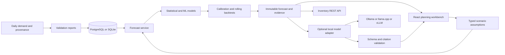

# DemandSense architecture

## Local demand planning workflow

<!-- mermaid:id=demandsense-architecture -->

```mermaid
flowchart LR
    D[Daily demand and provenance] --> V[Validation reports]
    V --> DB[(PostgreSQL or SQLite)]
    DB --> S[Forecast service]
    S --> F[Statistical and ML models]
    F --> B[Calibration and rolling backtests]
    B --> R[Immutable forecast and evidence]
    R --> UI[React planning workbench]
    UI --> SC[Typed scenario assumptions]
    SC --> S
    R --> INV[Inventory REST API]
    R --> AI[Optional local model adapter]
    AI --> O[Ollama or llama.cpp or vLLM]
    AI --> E[Schema and citation validation]
    E --> UI
```
